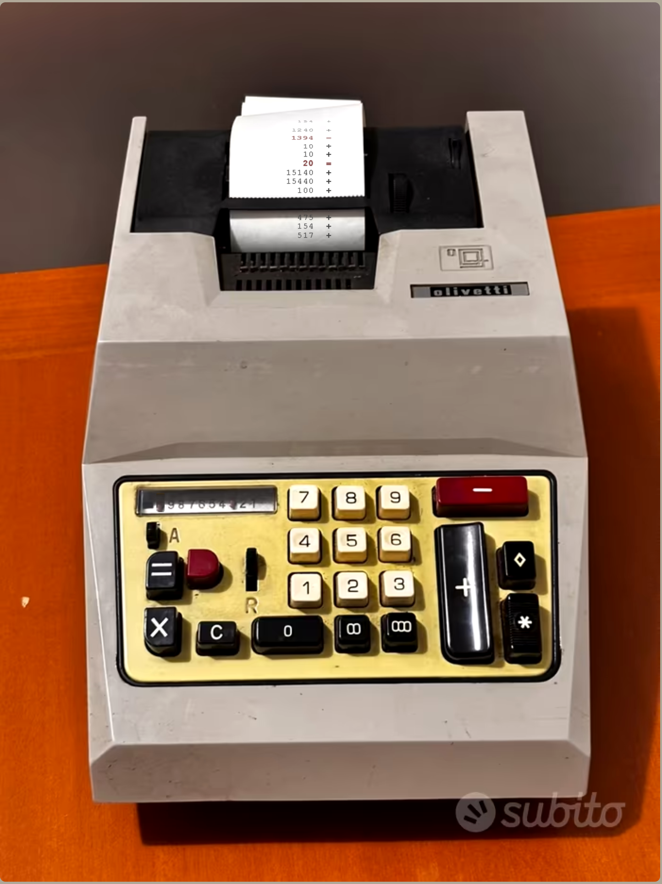
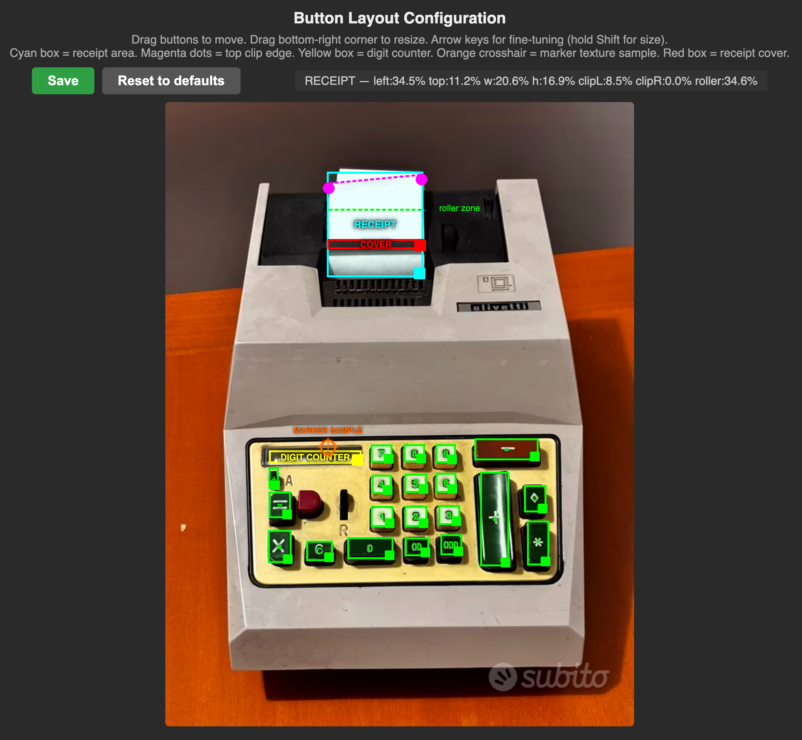

# Olivetti Multisumma 20 — Web Calculator

A faithful web recreation of the **Olivetti Multisumma 20**, a classic Italian adding machine from the 1970s. The calculator runs entirely in the browser and uses a real cloud backend for arithmetic operations and layout persistence.



---

## Built with Claude Code

This project was built entirely through a conversation with **[Claude Code](https://claude.ai/claude-code)** (Anthropic's AI coding assistant) as an experiment to see how far a real-world full-stack project could go with AI-assisted development — from a blank repo to a live cloud application with Google OAuth, without writing a single line of code manually.

Here's what we tackled together across the sessions:

- **Frontend** — pixel-accurate button overlays on a real machine photo, live paper receipt with typewriter ink effect, sliding digit counter, sound effects, keyboard support, responsive font sizing with CSS container queries
- **Bug fixes** — `00`/`000` digit counter moving by 1 instead of 2/3, `1+1+=4` arithmetic bug, unwanted sound on Clear key, receipt font shrinking before the paper
- **Architecture migration** — moved from a local FastAPI/Python backend to SAP CAP (Node.js) to deploy on SAP BTP with HANA Cloud
- **Cloud deployment** — full MTA setup (CAP backend + HANA DB deployer + Approuter), `mta.yaml`, `xs-security.json`, CF CLI deploy pipeline
- **Auth debugging** — diagnosed why public API endpoints returned 401 even with `authenticationType: none` in the Approuter, traced it through CAP's `jwt-auth` middleware, `http.js` module-level `restrict_all_services` evaluation, and the runtime `requiresHandler`; fixed with `@requires: 'any'` on the service and `@requires: 'authenticated-user'` on the protected action
- **Google OAuth** — wired up SAP IAS as an identity broker between XSUAA and Google OAuth, including BTP trust configuration and IAS social sign-in setup

---

## Why

The Olivetti Multisumma 20 is one of the most beautiful pieces of industrial design ever made. This project recreates it as a working web app — not a simulation, but a pixel-accurate overlay on a photograph of the real machine. Buttons are invisible overlays positioned on top of the photo. The paper receipt prints in real time as you calculate, complete with typewriter font and ink texture. The digit counter slides like the physical one.

It started as a frontend experiment and grew into a full-stack cloud application deployed on SAP Business Technology Platform (SAP BTP), with HANA Cloud as the database and Google OAuth for authentication.

---

## How It Works

### Frontend

- A high-resolution photo of the real machine is the entire UI
- Transparent `<button>` overlays are positioned precisely over each physical key
- The paper receipt is rendered as live HTML/CSS, scrolling upward as you type
- A digit counter marker slides horizontally, mimicking the mechanical one
- Sound effects play on key press and paper feed
- The layout (button positions, receipt area, counter position) is fully configurable via a drag-and-drop config page and persisted to the cloud

### Backend — SAP CAP (Cloud Application Programming Model)

The backend is built with **SAP CAP** (Node.js), exposing an OData V4 service at `/api`:

| Operation | Auth | Description |
|---|---|---|
| `GET /api/add(a=X,b=Y)` | public | Addition |
| `GET /api/subtract(a=X,b=Y)` | public | Subtraction |
| `GET /api/multiply(a=X,b=Y)` | public | Multiplication |
| `GET /api/divide(a=X,b=Y)` | public | Division |
| `GET /api/getLayout()` | public | Load saved layout |
| `POST /api/saveLayout` | 🔒 login required | Save layout |

Arithmetic is intentionally handled server-side — the whole point is that the machine "does the math".

### Database — SAP HANA Cloud

Layout configuration is stored in a HANA Cloud HDI container. A single row holds the JSON layout data (button positions, receipt area, counter track).

### Authentication — XSUAA + SAP IAS + Google OAuth

The config page (`/config.html`) is protected. The auth chain is:

```
Browser → SAP Approuter → XSUAA → SAP IAS → Google OAuth
```

- **SAP Approuter** handles routing and session management
- **XSUAA** (Authorization and Trust Management) issues JWT tokens
- **SAP IAS** (Identity Authentication Service) acts as the identity broker
- **Google OAuth** is configured as a social sign-in provider in IAS

Public users can use the calculator freely. Only authenticated users (via Google login) can save layout changes.

---

## Stack

| Layer | Technology |
|---|---|
| Frontend | Vanilla JS, CSS, HTML |
| Backend | SAP CAP (Node.js), OData V4 |
| Database | SAP HANA Cloud |
| Auth | SAP XSUAA + SAP IAS + Google OAuth |
| Hosting | SAP BTP Cloud Foundry (US10) |
| Deployment | MTA (Multi-Target Application) |

---

## Try It

**Live app:** https://30fb9128trial-dev-olivetti-calculator-app.cfapps.us10-001.hana.ondemand.com

> ⚠️ The app may be offline — SAP BTP trial and HANA Cloud trial instances stop automatically after inactivity. If the calculator doesn't load or shows an error, **write to me and I'll start it back up**.

### What you can do

- Use the calculator normally — click keys or use your keyboard (`0-9`, `+`, `-`, `*`, `/`, `Enter`, `Esc`)
- Watch the paper receipt print in real time
- The `*` key prints a total, `◇` prints a subtotal

### Config page (login required)

https://30fb9128trial-dev-olivetti-calculator-app.cfapps.us10-001.hana.ondemand.com/config.html

Log in with Google to access the layout editor, where you can drag buttons and adjust the receipt area to match the photo perfectly.



---

## Run Locally

```bash
npm install
npm run dev
```

Opens at `http://localhost:4004`. Uses SQLite in development — no HANA or XSUAA needed.

---

## Deploy to SAP BTP

Requires the MTA Build Tool (`mbt`) and CF CLI logged in to your BTP space.

```bash
mbt build
cf deploy mta_archives/olivetti-calculator_1.0.0.mtar
```
